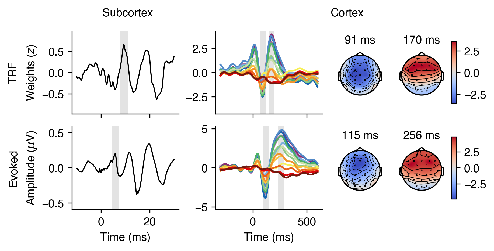

# Preprocessing and encoding analysis pipelines for the encoding of natural speech at the subcortical and cortical level

## Description

This repository contains the data pipelines pipelines described in "Data preprocessing" and "TRF modeling" in our paper entitled "Auditory encoding of natural speech at subcortical and cortical levels is not indicative of cognitive decline", [doi:10.1523/eNeuro.0545-23.2024](https://doi.org/10.1523/ENEURO.0545-23.2024).

We share the code for reasons of transparency. The data—EEG and audio files—cannot be shared, but are available upon request. The code is adapted to our environment and data infrastructure and cannot be executed without adjustments.

* The required modules that we have used to execute our code can be found in the `environment.yml` file.
* All data paths would have to be adapted to your own data infrastructure.

## Structure

* The EEG and audio file preprocessing pipelines are located in the `preprocessing` folder.
* In `preprocessing/audio` there is a subfolder called `an_model` which contains the scripts and an additional environment (`an_model_environment.yml`) that I needed to generate the speech features (auditory nerve rates) for subcortical analyses.
* The pipeline for the encoding analyses is located in the `encoding` folder.
* Please note that the TRF model is referred to in the scripts as "encoding model" and "encoder" and the regularization parameter λ as "alpha"

## Acknowledgments

We would like to thank Shan et al. (2024) as we benefited from their published analysis pipeline when generating speech features from auditory nerve rates, GitHub repository [Music_vs_Speech_abr](https://github.com/maddoxlab/Music_vs_Speech_abr) and publication [doi:10.1038/s41598-023-50438-0](https://www.nature.com/articles/s41598-023-50438-0).
